# Annotation Management Process

This document guides through the annotation management process.

1. Search or filter dataset from datasets collection or

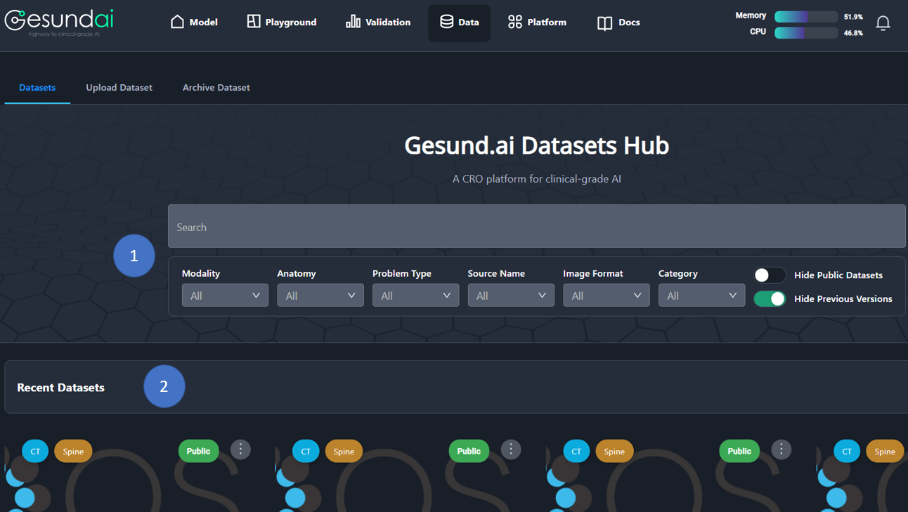

2. Choose dataset from **Recent Datasets**

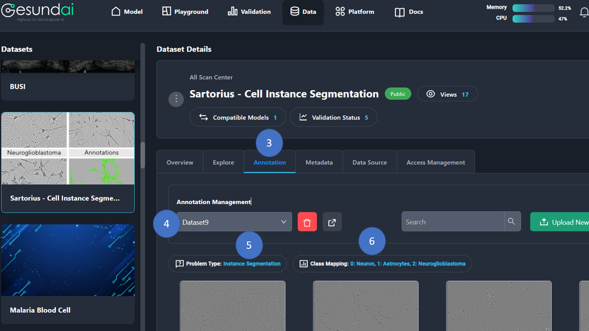

3. Click on the **Annotation** tab.

4. You can **select annotation** from list of annotations.

5. Problem type of selected dataset.

6. Class mapping of selected dataset.

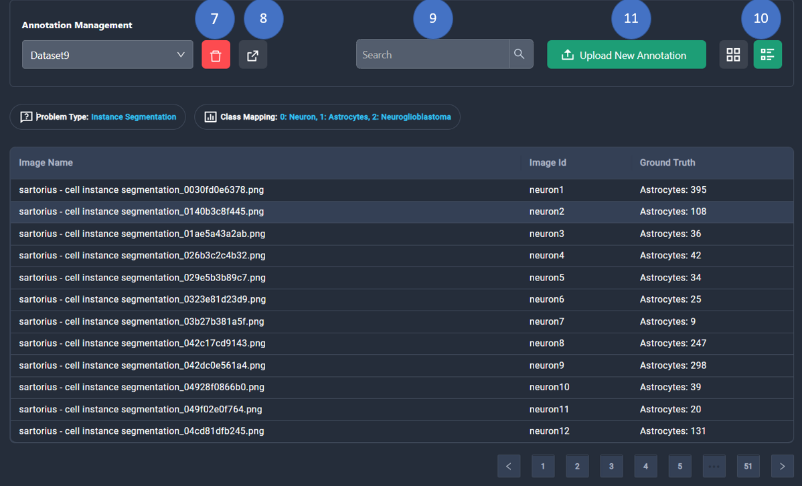

7. You can **delete annotation** with delete button.

8. You can **Export annotation as CSV file** with export button.

9. You can **search annotation** with search bar.

10. YOu can change the view of annotations as **list view** or **card view**.

11. Click on the **Upload New Annotation**, a modal will open up. There are **two options** for uploading new annotation.

## How to Upload New Annotation

## Option 1: Clone From Previous Annotation

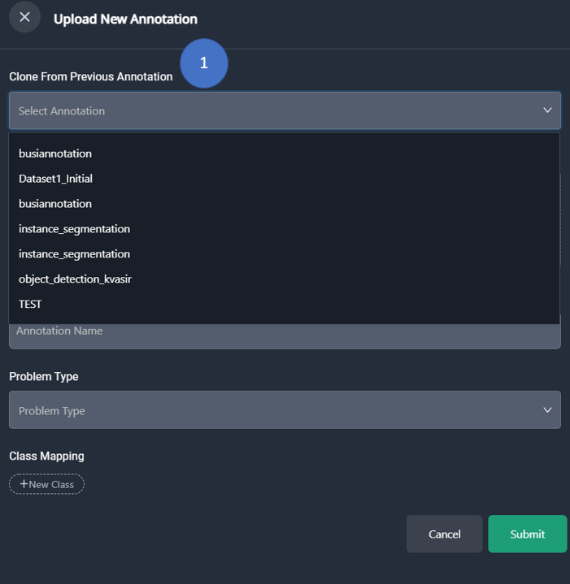

1. First option is **cloning from previous annotation**. For cloning from previous annotation select annotation from select box.

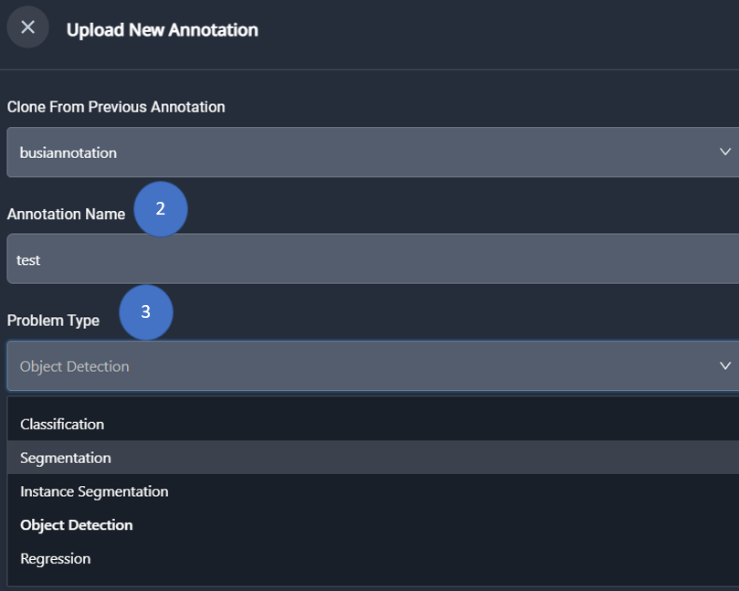

2. Enter name for annotation.

3. Select **problem type** for annotation from select box.

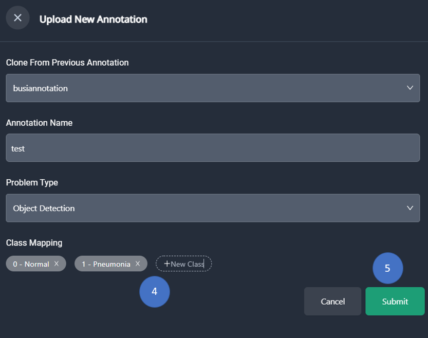

4. Remove class mapping from tag list or add class mapping as new tag.

5. Click on the **Submit** button.

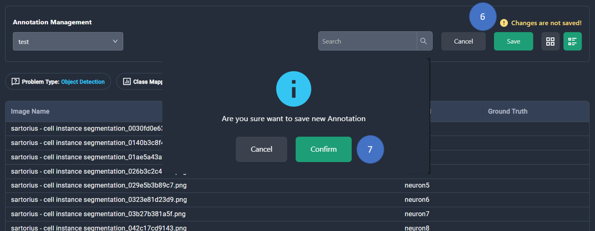

6. Click on the **Save** button and modal will open.

7. Click on the **Confirm** button to finish uploading new annotation and then changes will be reflected.

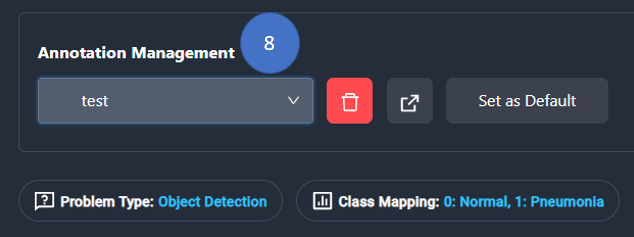

8. Newly uploaded annotation can be seen from the select box below the **Annotation Management** title.

## Option 2: Upload Annotation File

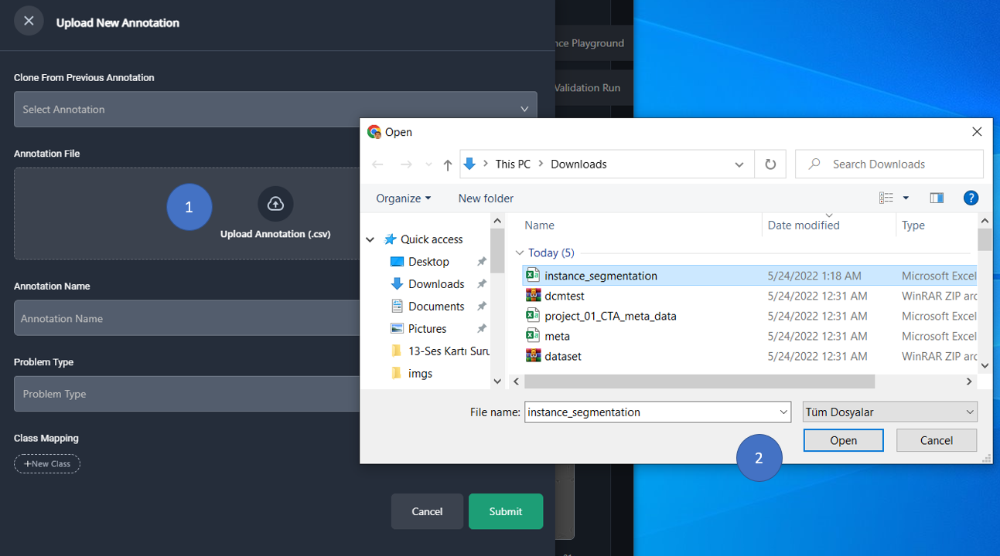

1. Second option is uploading CSV file. For uploading CSV file click **Upload Annotation** field and modal will open. 

2. Select CSV file and click on the **Open** button. CSV file will upload after click.

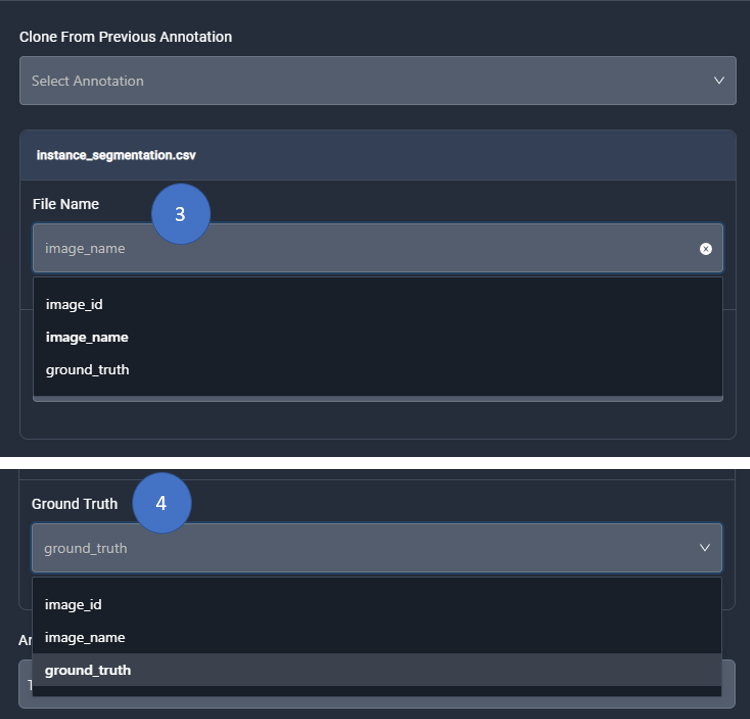

3. Select appropriate name field from select box.

4. Select grund truth field from select box.

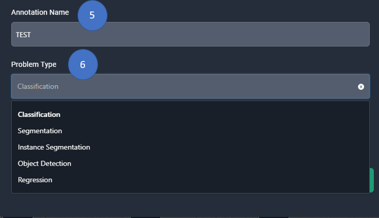

5. Enter name for annotation.

6. Select **problem type** for annotation from the select box.

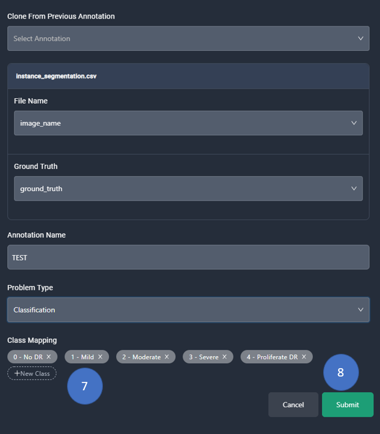

7. Remove class mapping from tag list or add class mapping as new tag.

8. Click on the **Submit** button.

9. Follow the steps **6-7-8** mentioned in the **Option 1** Section.

## Show Ground Truth (Problem Type: Instance Segmentation)

There are two options to see ground truth on annotation.

### Option 1: Show Ground Truth From List View

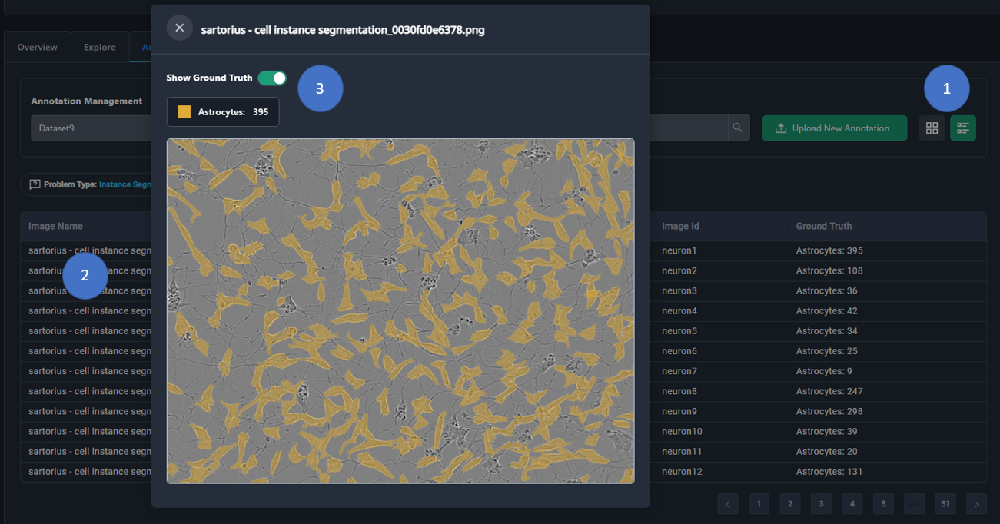

1. Click on the list view button.

2. Select data from list.

3. Show or hide ground truth for problem type **instance segmentation**

### Option 2: Show Ground Truth From Card View

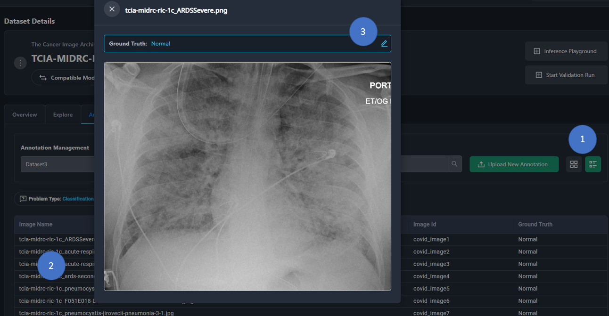

1. Click on the card view button.

2. Select data from list.

3. Show or hide ground truth for problem type **instance segmentation**

## Update Ground Truth (Problem Type: Classification)

There are two options to update ground truth on annotation.

### Option 1: Update Ground Truth From List View

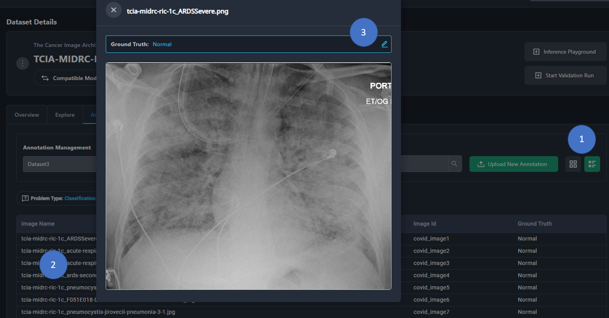

1. Click on the list view button.

2. Select data from list.

3. Click on the edit button for editing Ground Truth.

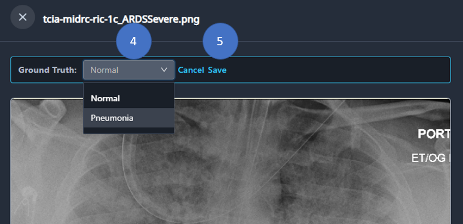

4. Select Ground Truth from list.

5. Save changes.

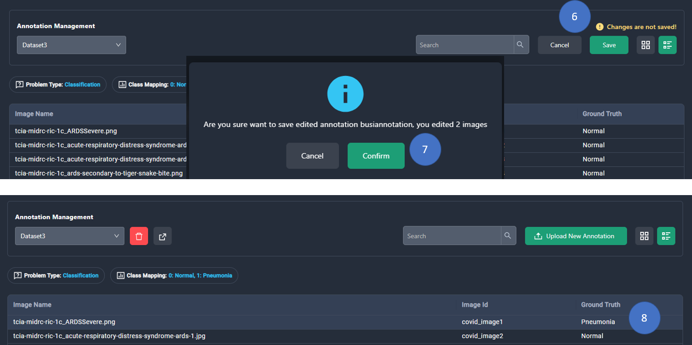

6. Click on the **Save** and modal will open. Click cancel or confirm to finish editing process.

7. Confirm editing annotation and changes will be reflected.

8. Edited data can be seen from list.

### Option 2: Update Grund Truth From Card View

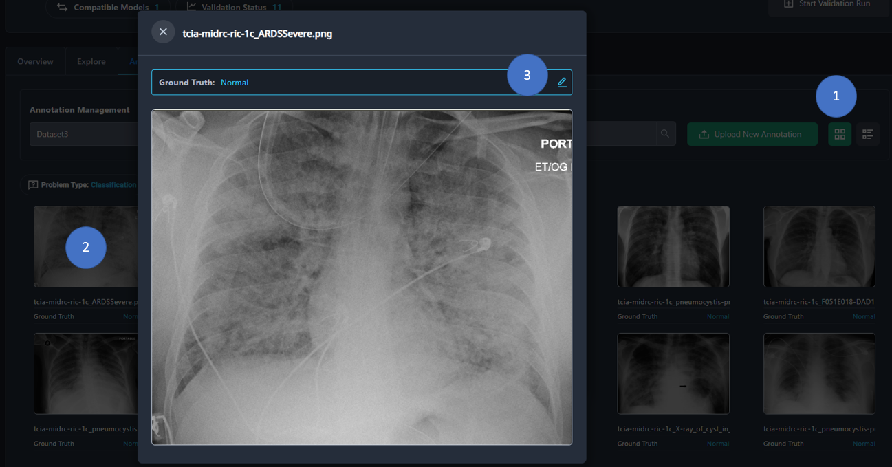

1. Click on the card view button.

2. Select data from list.

3. Click on the edit button for editing Ground Truth.

4. Follow the steps **4-5-6-7-8** mentioned in the **Option 1** Section.
