# Metadata Management Process

This document guides through the metadata management process.

1. Search or filter dataset from datasets collection or

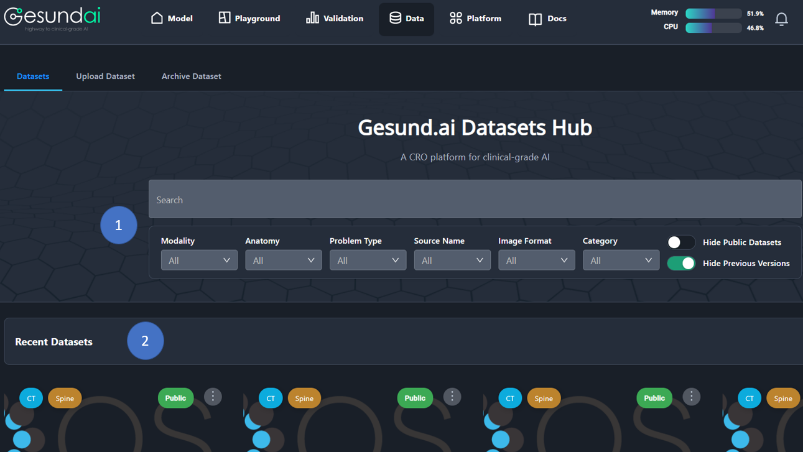

2. Choose dataset from **Recent Datasets**

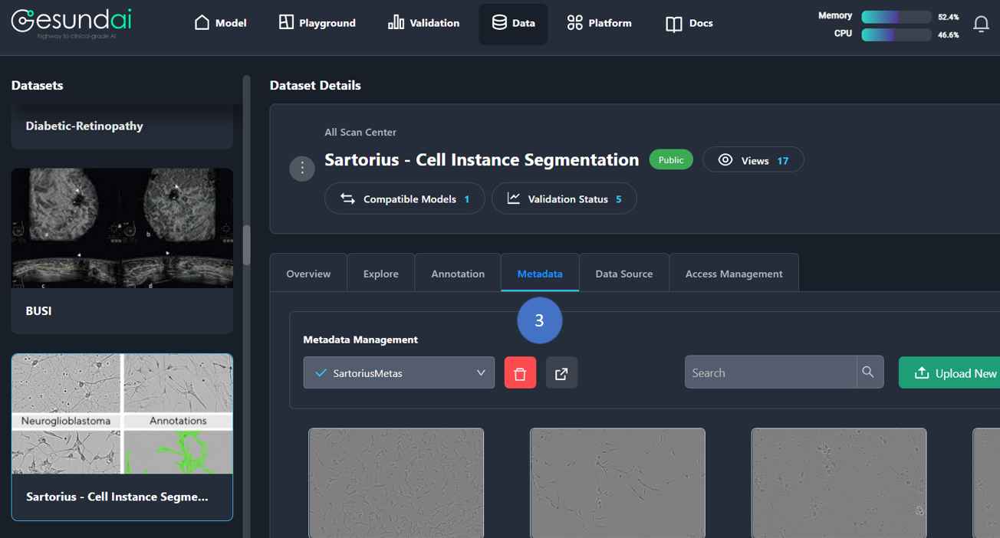

3. Click on the **Metadata** tab.

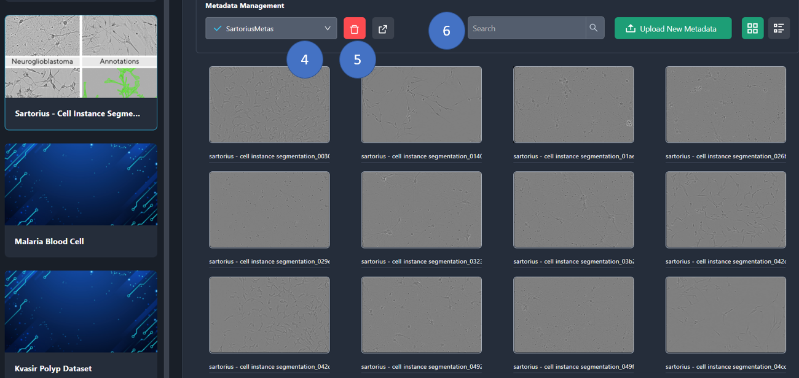

4. You can **select metadata** from list of metadatas.

5. You can **delete metadata** with delete button.

6. You can **search metadata** with search bar.

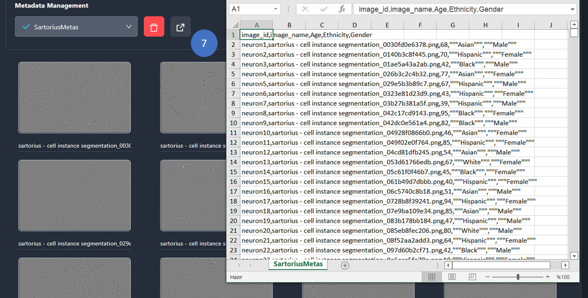

7. You can **Export metadata as CSV file** with export button. Sample downloaded metadata CSV file can be shown at image.

## Update metadata

There are two options to update metadatas.

### Option 1: Update metadata from list view edit button

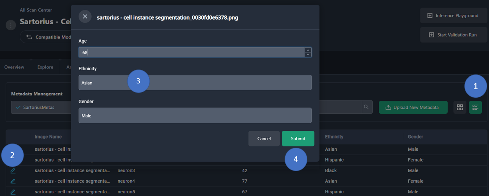

1. Click on the **list view** button.

2. Click on the **Edit** button. Modal will open.

3. Edit the fields in modal.

4. Click on the **Submit** button.

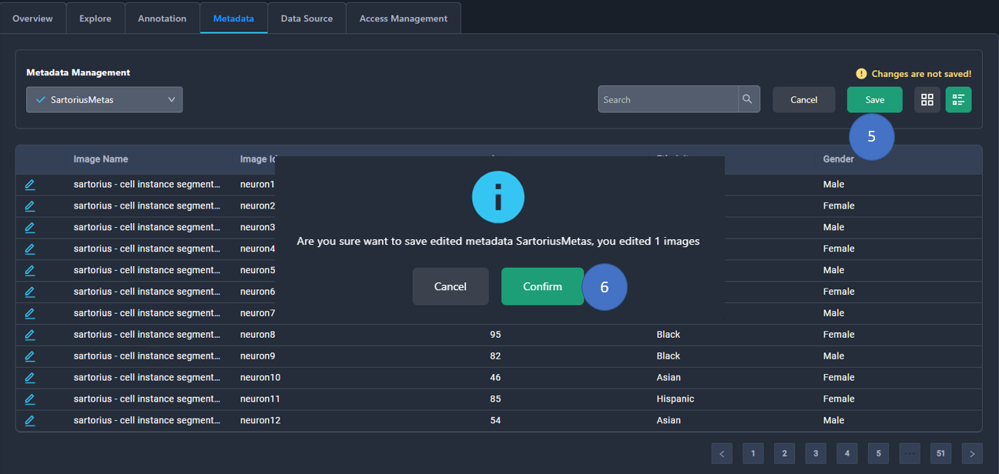

5. Click on the **Save** button and modal will open.

6. Click on the **Confirm** button to finish edit metadata process. Metadata will be updated.

### Option 2: Update metadata from list view item

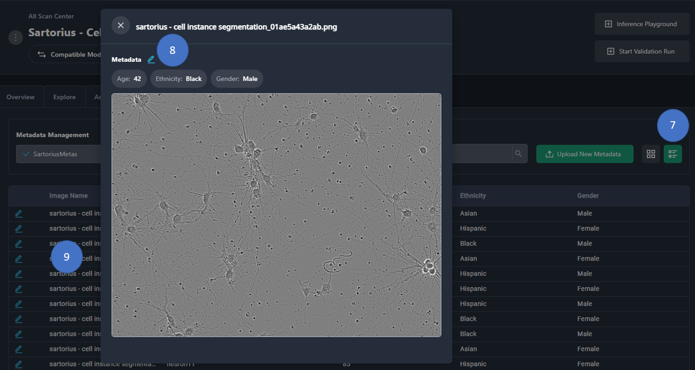

7. Click on the **list view** button.

8. Click on the metadata from list. Modal will open.

9. Metadatas can be seen on the modal. Click on the **Edit** button to edit metadatas. Modal will open.

10. Follow the steps **3-4-5-6** mentioned in the **Option 1** Section.

### Option 3: Update metadata from card view

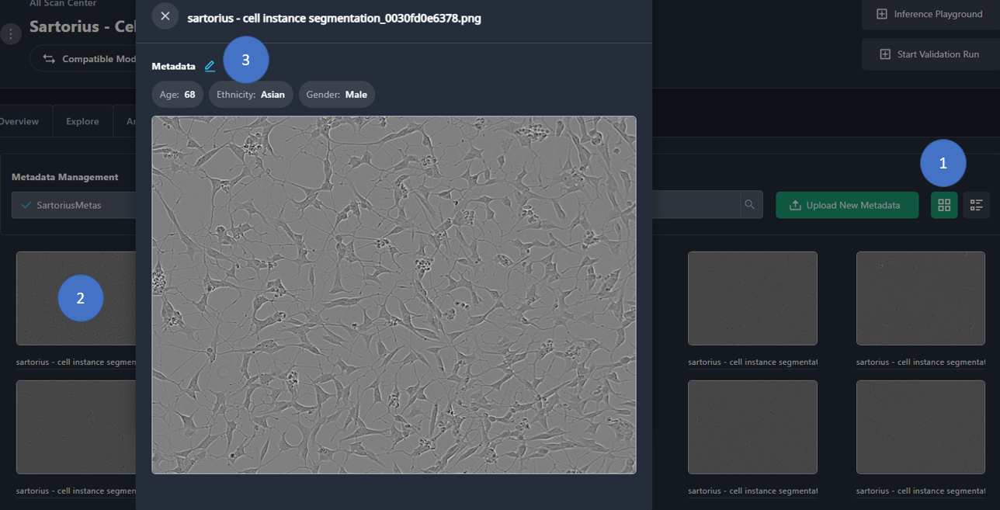

1. Click on the **card view** button.

2. Click on the **Edit** button. Modal will open.

3. Follow the steps **3-4-5-6** mentioned in the **Option 1** Section.

## How to Upload New Metadata

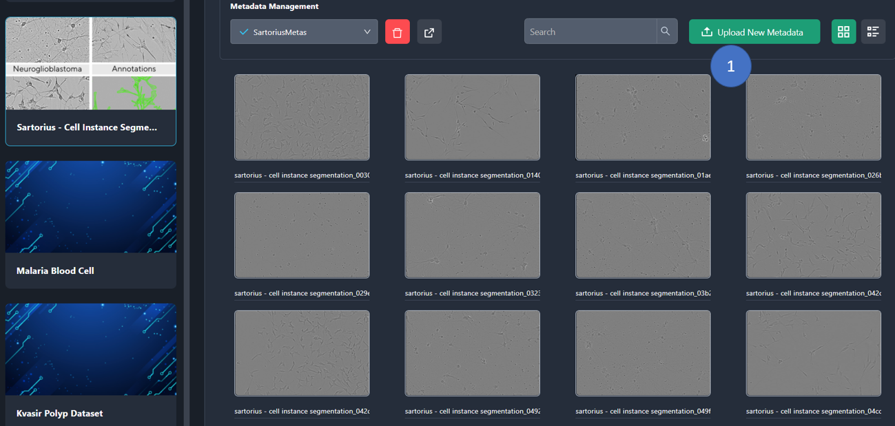

1. Click on the **Upload New Metadata** button, a modal will open up. There are three options for uploading new metadata.

## Option 1: Clone From Metadata

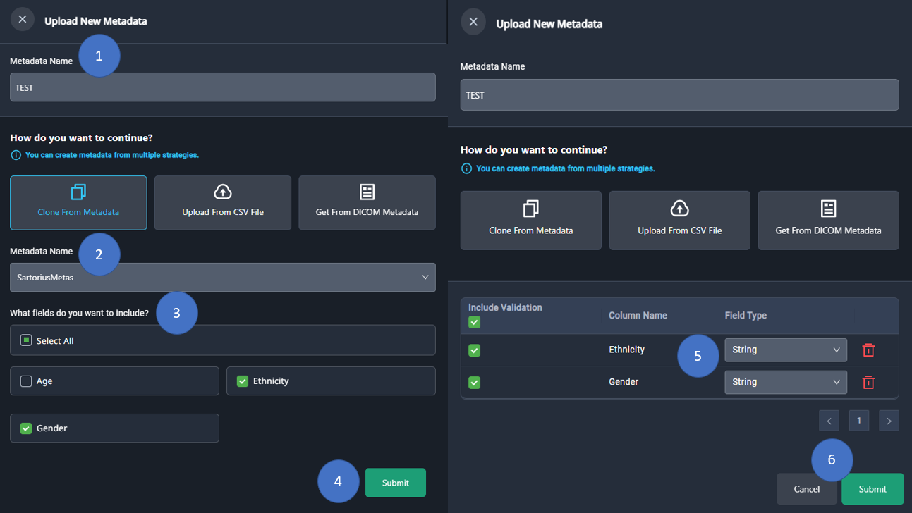

First option is cloning from metadata. For cloning from previous annotation select annotation from list.

1. Enter name for metadata.

2. Click on the **Clone From Metadata** and select existing metadata from select box for cloning from previous metadata.

3. Select the fields that will be include in validation. All of the fields or few fields can be select.

4. Click on the **Submit** button.

5. **Select, deselect or remove** field types that will be in validation process.

6. Click on the **Submit** button. Modal will close and you will see **Cancel** and **Save** buttons as shown at image.

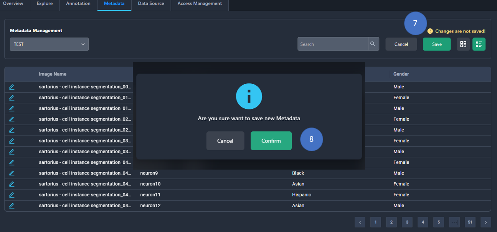

7. Click on the **Save** button and modal will open.

8. Click on the **Confirm** button to finish upload metadata process.

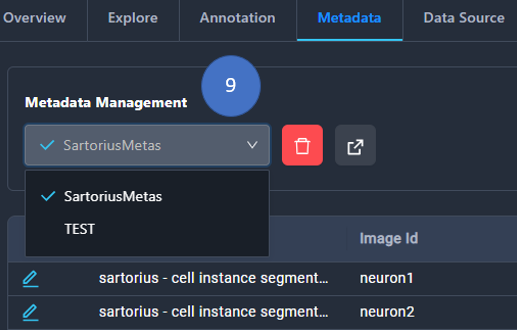

9. Newly uploaded annotation can be seen from the select box below the **Metadata Management** title.

## Option 2: Upload Metadata File

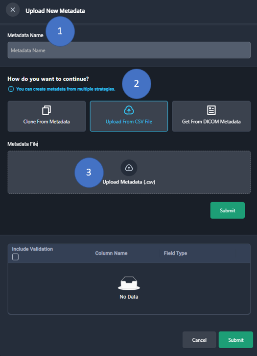

Second option is uploading Metadata as CSV file.

1. Enter name for metadata.

2. Click on the **Upload from CSV File** button.

3. Click on the **Upload Metadata** field and modal will open.

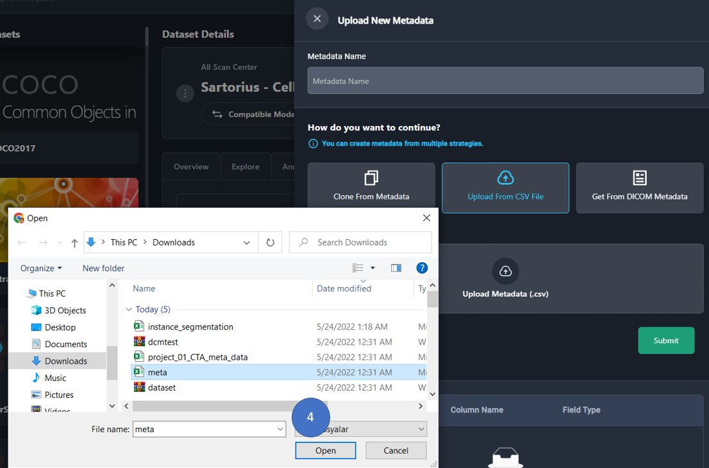

4. Select metadata file and click **Open** button. CSV file will upload after click.

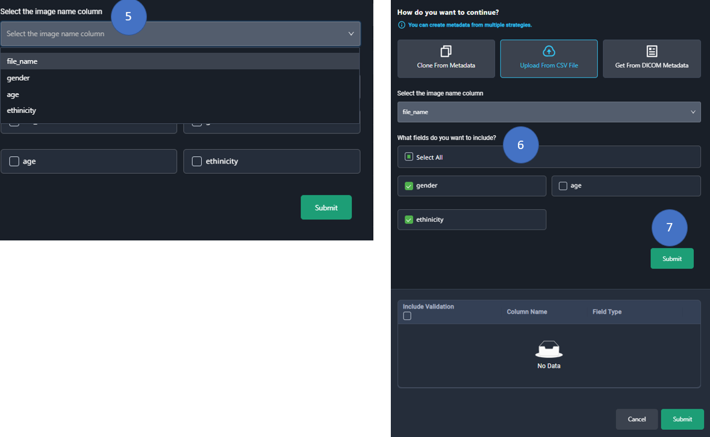

5. Select the image name column from the select box.

6. Select the fields that will be include in validation. All of the fields or few fields can be select.

7. Click on the **Submit** button.

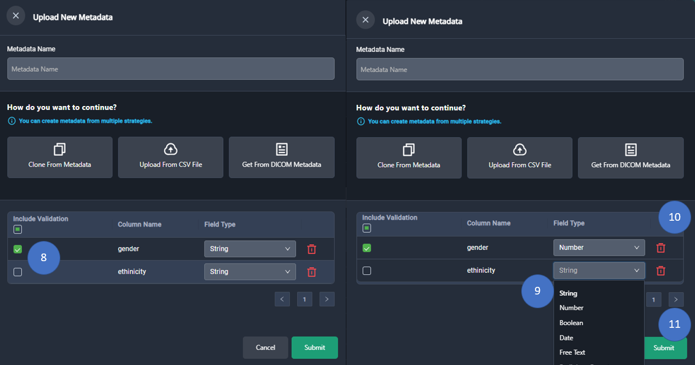

8. **Select, deselect or remove** field types that will be in validation process.

9. Select appropriate field type from the select box.

10. **Delete field** from list that will not include in validation.

11. Click on the **Submit** button and modal will be close.

12. Follow the steps **7-8-9** mentioned in the **Option 1** Section.