# Dataset Upload and Management Process

This document guides through the dataset upload process.

# How to Upload a dataset

The platform supports multiple options for uploading any dataset, which you may choose from.

### Option 1: Uploading a dataset zip file to local storage

This option enables you to upload a zip file to the platform local storage.
Choosing this option you can upload a zip file, and its respective metadata file.
At the moment, the platform supports metadata file with **.csv** extension.

***Note: This option would be efficient in uploading the dataset files with size <500mb. The zip file should not contain nested folders.***

Following are the **steps** to upload a dataset zip file and the metadata

1. Select the file type of the dataset. The platform supports uploading, **PNG, JPG, NIFTI, DICOM, TIFF** types of images.

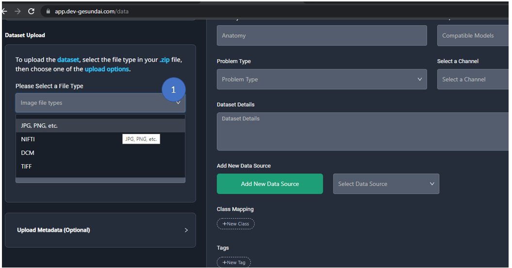

2. Select **Upload Dataset .zip file** option.

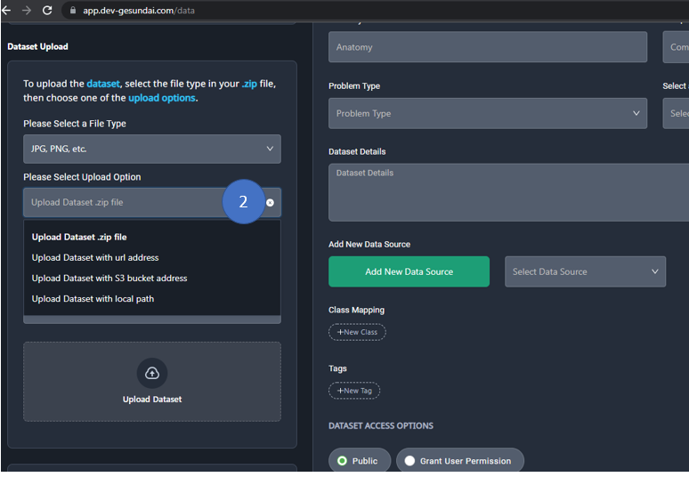

3. Select the dataset destination, here we will choose to store the image in the local storage of the platform

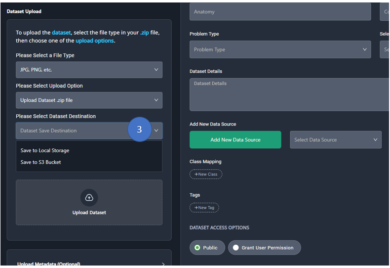

4. Click on the **Upload Dataset**, select the zip file you wish to upload  

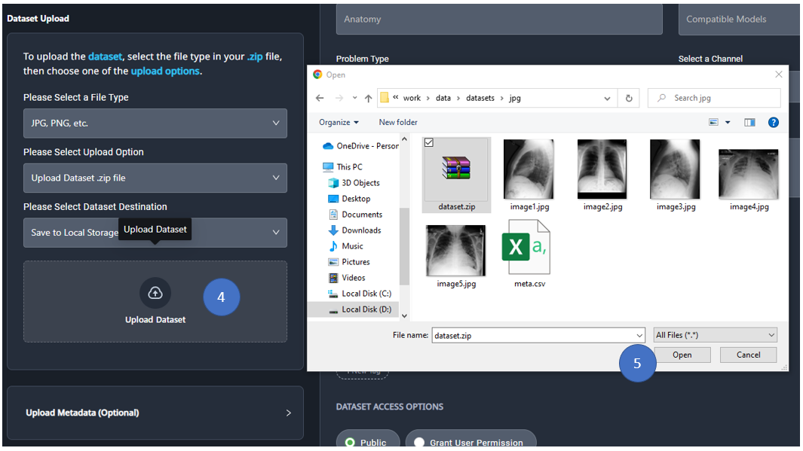

5. Click on the **Open** button

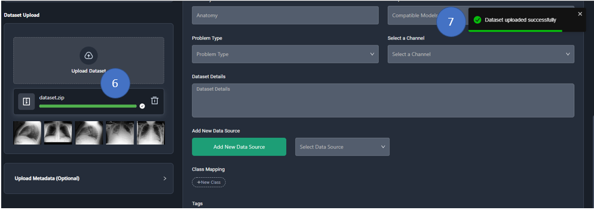

6. When the upload is successful, you will see a green completed progress bar. 
A set of 10 images as thumbnails will be displayed, from the given the zip file.
Here there are only 5 files in the zip hence all the images are displayed as thumbnails 

7. A notification will be blinked when the dataset upload is successful.

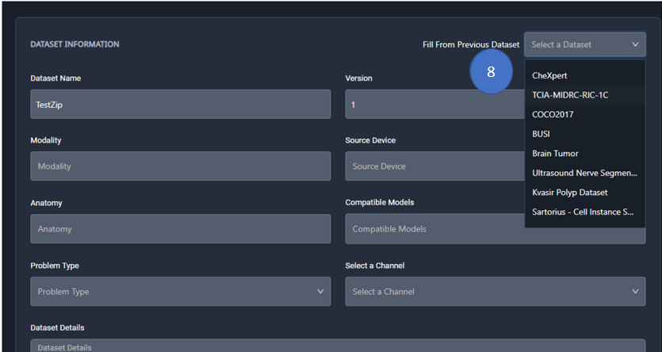

8. The final step here is to fill the form that is required to publish your data card on the platform.
You can choose to fill the form from any of the existing Data Cards as per the similarity of the dataset.
For this example we will select CovidNet data with is similar to the images we uploaded.

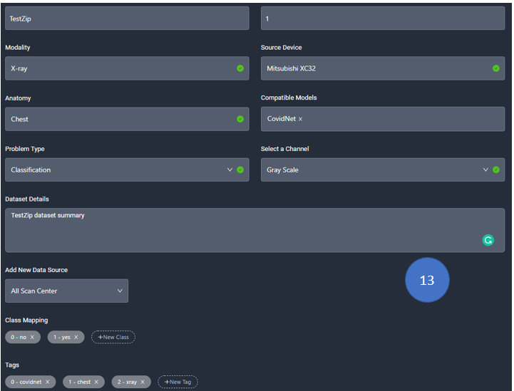

9. Fill in the required details of the form

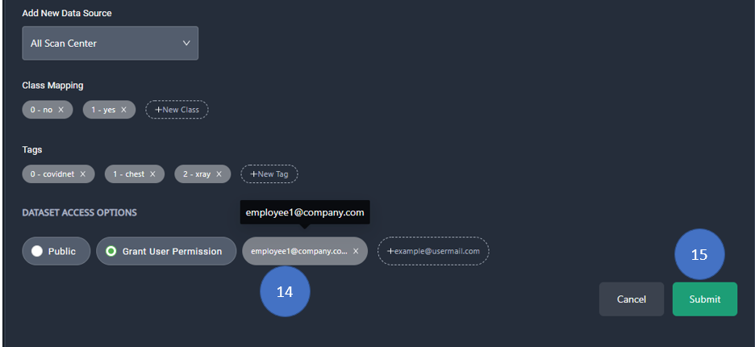

10. Set the permission on the dataset. If you wish to make the dataset public, click on the **Public** button.
If you wish to make it private, add the email id of the list of users who can access the dataset.

11. Click on the **Submit** button, and you will get a notification that the model is uploaded successfully.

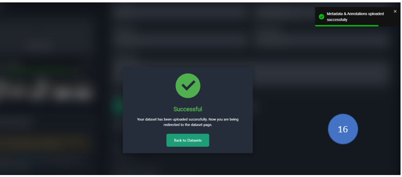

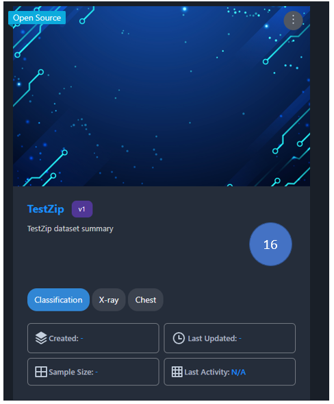

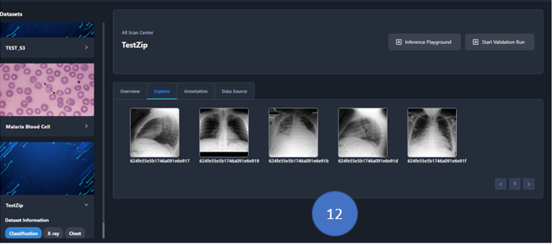

12. Go **Datasets** tab, and you will see the uploaded dataset. 
Click on the Data Card and you will be able to see a dashboard, click on the explore tab, and you will see the images in the dataset.

### Option 2: Uploading a dataset zip file to s3 bucket

Using this option you will be able to upload the zip file from your local to a s3 bucket of your choice.

***Note: This option would be efficient in uploading the dataset files with size <500mb. The zip file should not contain nested folders.***

Following are the steps to upload the dataset zip file to s3 bucket.

1. Follow the steps 1 - 2 mentioned in the **Option 1** section.

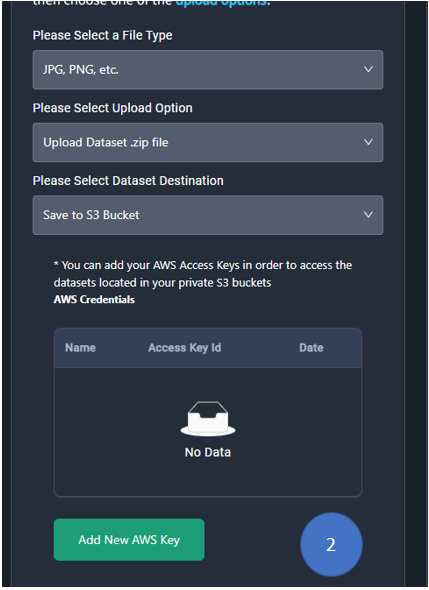

2. Select **Dataset Destination** as **Save to S3 Bucket**. Click on the **Add New AWS Key** button to add new aws key, if you have already
added it then you can select from the aws credential drop down list. 
You can check **How to add AWS Credentials** section to add aws credentials to the platform.

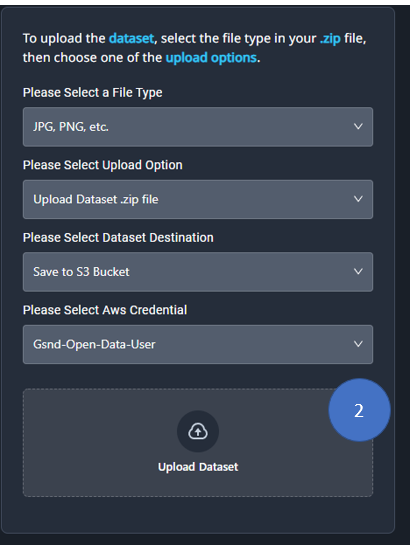

3. Follow the steps **8 - 16** from **Option 1: Uploading dataset zip file to local storage.**  It would be exactly the same. 

### Option 3: Uploading a dataset from URL Link

This option enables you to download the data from any zip url, for e.g. a shared Google Drive link of a zip file and store it either in the local
storage of the platform or in the AWS s3 bucket.

***Note: The zip file should not contain nested folders.***

1. Select the respective options from the drop-down list, as mentioned in the following image. 

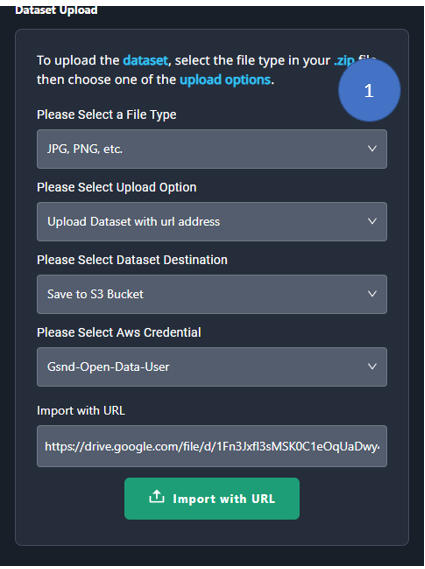

2. Click on the **Import with URL**. You will see thumbnails of the imported image files.
To delete the uploaded files click on the **Delete Uploaded File**

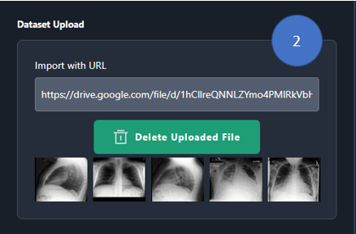

3. Follow the steps **8 - 16** from **Option 1: Uploading dataset zip file to local storage.**  It would be exactly the same. 

### Option 4: Adding the dataset from AWS S3 bucket

This option enables you to add dataset directly into the platform, using the S3 bucket. This option assumes the dataset is already uploaded in the S3 bucket.
Here, there is no uploading step, rather the dataset is added directly into the place considering AWS S3 bucket as the source.

***Note: The S3 folder should not contain nested folders.***

Following are the steps to add the dataset to the platform

1. Select the file type. Select **Upload Dataset with S3 bucket address**, in the **Upload Option**.
Select the **AWS Credentials**. Enter the **Bucket Name** and **S3 Dataset Path**. 

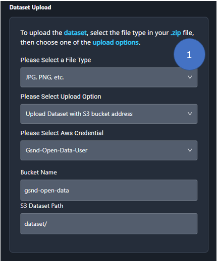

The **S3 Dataset Path** should have no nested folders, it should have images. Following is the image as an example.

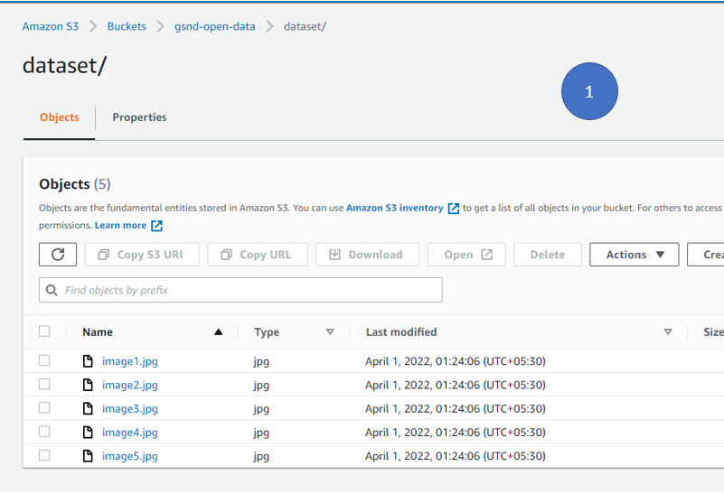

2. Follow the steps **8 - 16** from **Option 1: Uploading dataset zip file to local storage.**  It would be exactly the same.

### Option 5: Adding the dataset from local path

This option enables you to add dataset directly into the platform, using the local path. This option assumes the dataset is already uploaded in the platform.
Here, there is no uploading step, rather the dataset is added directly into the place considering local path as the source.

1. Select the **File Type**, **Upload Option** as **Upload Dataset with local path**.
Enter the local path. 

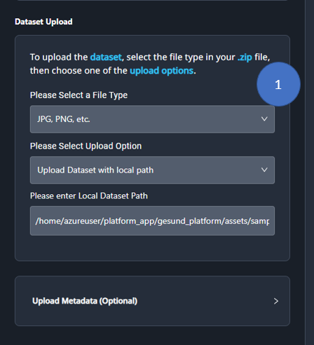

2. Follow the steps **8 - 16** from **Option 1: Uploading dataset zip file to local storage.**  It would be exactly the same. 

# How to Upload the Dataset Cover Image

1. Click on the **Data** page of the application

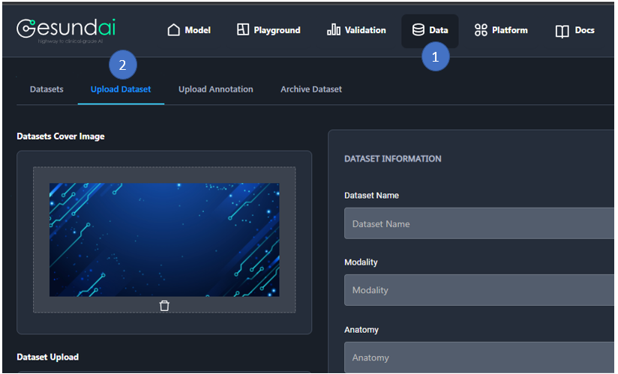

2. Click on the **Upload Dataset** tab

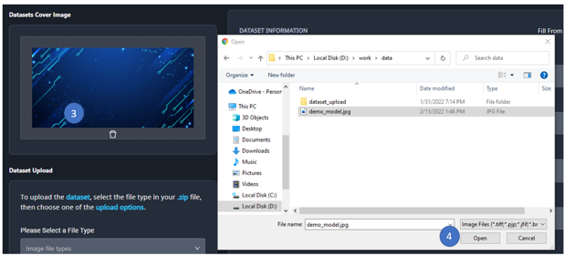

3. Click on the **image area**, an image upload dialog box will open up and then upload the image of your choice.

4. Click on **Open**

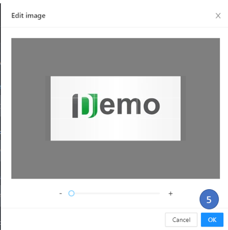

5. Adjust the image if you may like and then click on **OK**

## How to add AWS Credentials

This section explains the steps to add AWS Credentials to the platform. AWS credentials will be needed if AWS S3 is your choice of storage 
for your datasets. It will be also needed to store models in the S3 bucket. At the moment, the platform supports AWS cloud platform.

Following are the steps to add AWS Credentials.

1. Click on the **Platform** page > **AWS Credentials** > **Add New AWS Key**

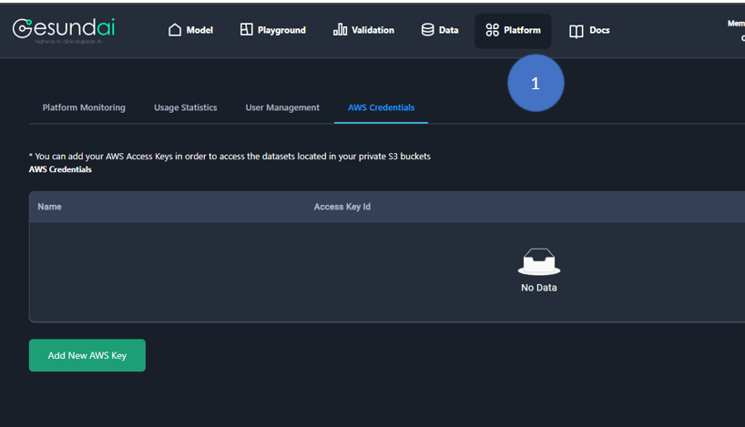

2. You will get a dialog box to enter the name, access key id and secret access key. 
The secret access key will be encrypted and stored in our database. Click on the **Submit** button

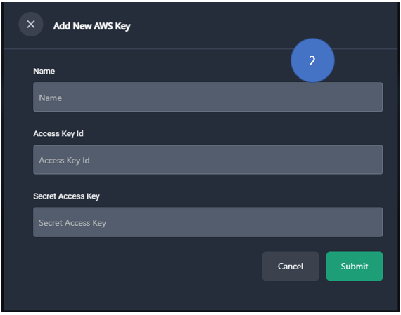

3. Once you click on the **Submit** button, you will get the notification and the newly added credentials will be displayed.

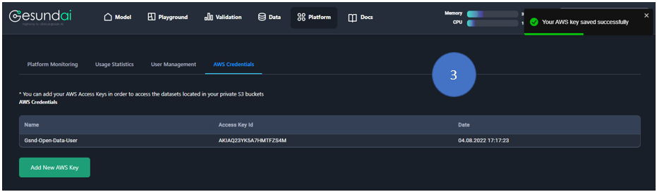
