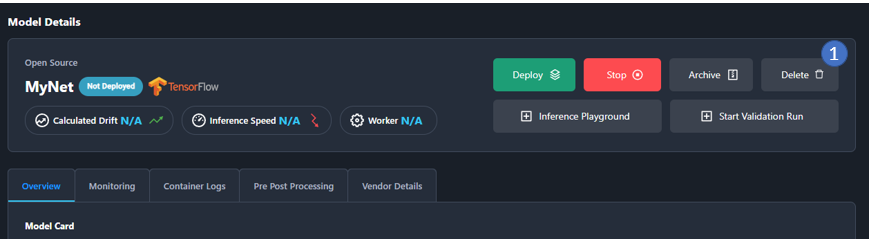
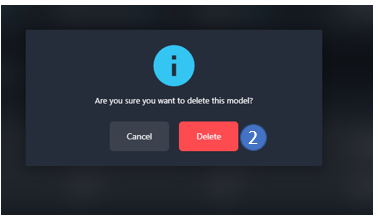
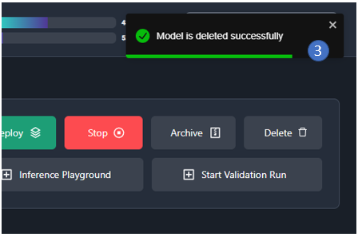
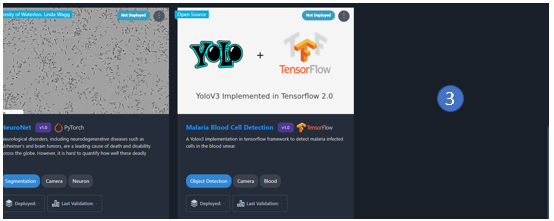

This document guides through the model upload process.
# Step 1: Download the model artifacts template

We need to upload model artifacts to follow a certain template, in-order to be uploaded and deployed successfully. Follow the steps to download the template

1. Click on the **Model** page of the application

2. Click on the **Upload Models** tab

3. Click on the **Download & Upload Artifacts** on the bottom of the page. You will see a modal popping up as shown in the below image.

4. Click on the **Download Artifacts** Tab in the model

5. Select the **Model Type** of your choice, the choices are limited for now, new model types will be added in time. The choices include the *Classification, Object Detection, Segmentation.*

6. Select the **Framework** of your choice. When you select the **Model Type** the next filter will be a subset of available **Framework**’s list under the given **Model Type.** The choices include *TensorFlow, PyTorch, Onnx, Keras*

7. Select the **Architecture** of your choice, the **Architecture** list will be a subset list as per the selected **Model Type** and **Framework.** 

***Note: There are two types of architecture, default and user, when you download the artifacts, it will from a default model list that we have already implemented in our platform. You might have to structure the model bundle as per our structure.***

8. Click on **Download Artifacts**

9. After download you will get two responses from the application, a **model\_artifacts.zip** file will be downloaded and a notification will be popped up.

The zip file would contain the following files list

# Step 2: Model artifacts content explanation

In reference with the above image, follow the instructions to implement your model architecture

1. The [**\_\_init\_\_.py**](artifacts/__init__.py) file contains the models import from model .It should also have prediction , postprocess and response python scripts.

    

2. Here, the **classifier.h5** is the model used in this example, it can any saved model that includes *.pth, .pt, tensorflow checkpoints, pt model checkpoints, .onnx model, .sklearn model etc.*

3. The [**loss.py**](artifacts/loss.py) is the python script where you will store all your loss functions in the form of loss functions or loss class as per your requirement

4. The [**model.py**](artifacts/model.py) is the main python file that includes the model load, prediction and loss calculation definitions. 

    The main point to note here is registering your model class.

    

    4.1 Write the name of the class 
        
         Make a note that the class should be named GesundModel.

5. Write your preprocess function in the [**postprocess.py**](artifacts/postprocess.py) python file as a class or function.

6. Write your preprocess function in the [**preprocess.py**](artifacts/preprocess.py) python file as a class or function

7. For model deployment we require a [**reqs.txt**](artifacts/reqs.txt) file that includes the package versions required for this file.

8. Write the response schema in the [**schema.py**](artifacts/schema.py) as per the postprocess output.

8.1. Import the out schema from register to register your response model. It would be a pydantic model

8.2. Decorate the class with outschema class and register module function to register your class with respective namespace (it should be the same as used to register model class and default set to false)

# Step 3: Upload the model artifacts

Model artifacts are uploaded in the form of a zip file. (Upload from web resource is under development). It should contain all the files mentioned in the step 2

Following are the steps to upload the model

1. Click on the **image area** in the model image card, to upload the model card face image.

2. An **upload window** will pop up for uploading the image

3. Edit the image if you like and click on **OK** button

4. Click on the **Download & Upload Artifacts** button, to upload the model zip file

5. Click on the **Upload Model** section

6. The first thing is to **Select Artifact Props** 

7. Select the **Model Type**, the problem that your model address. *Available in list are classification, object detection, image segmentation.*

8. Select the **Framework**, using which your model is built. Available in list are *Tensorflow, Keras, Onnx, PyTorch*

9. **Include Model Files** is turned on. This switch is to indicate the zip file includes saved model file in its respective format.

10. Enter the same **Namespace** that you have written for registering the model in the code. The namespace is the key for anchoring all the code and pull the relevant code while the model is deployed and the platform executes the code.

11. Click on the **Continue** button.

12. After you click on **Continue** button, the next section you will be directed to is the **Upload Files** section.

13. Click on the **Upload Model** area and select the model artifacts zip file that you have prepared.

14. When you upload the zip file the progress bar indicates the upload status. Once the upload is complete you will receive a notification on the top right of the screen stating the model upload being successful.

15. Fill in the model card details form, you can choose to **Fill From Previous Models.** 

16. Once the details are filled click on the **Submit** button.

17. There will be a pop-up notification stating the successful addition of model card to the platform. Click on the **Back to Models** button.

18. On the models page you will see your recently upload model enlisted as in the list of models.

Click on the model card area and it will redirect to this page where you can choose to deploy the model and start with model prediction in the playground section.

# Step 4: Delete the uploaded model

1. Click on the **Delete** button on the top right corner of the screen

2. Click on **Delete**

3. You will be notified about successful model deletion and it will be also removed from the model list page.

***Note: Once deleted the model cannot be retrieved. ***
