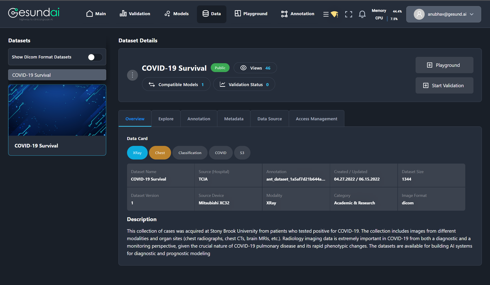
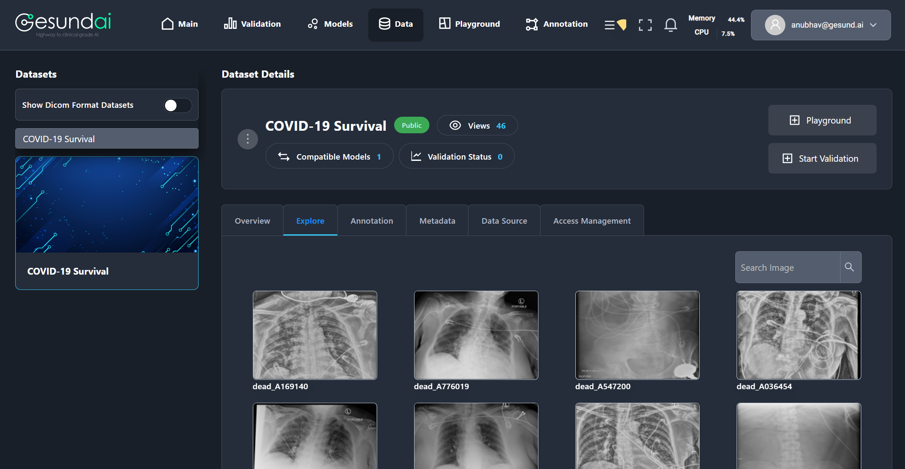
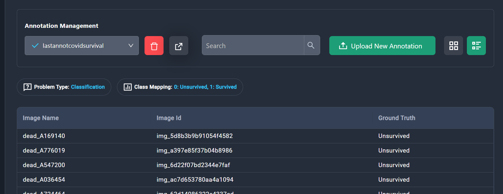
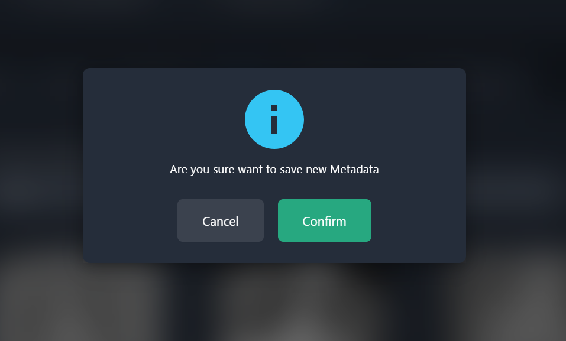

#  DATASET MANAGEMENT 

To Upload Dataset you can **click here** for the steps

Once you have uploaded the dataset you can 
check for the dataset 

1. Click on the **Data** page of the application

2. Click on the **Dataset** tab
    

3. Click on the **Dataset Card** that you have uploaded on the platform

    

 You can **explore** the dataset and add new **annotation** as well as **metadata** to the platform.

 1. Click on **Explore** to look into the dataset
    
 2. Click on the **Annotation** tab

 3. Click on the **Upload New Annotation**, a box will pop up. There are **two options** for uploading new annotation.
 
## How to Upload New Annotation

## Option 1: Clone From Previous Annotation

1. First option is **cloning from previous annotation**. For cloning from previous annotation select annotation from select box.

2. Enter name for the annotation.

3. Select the **problem type** for annotation from drop down menu.

4. Add class mapping as new tag if there are more classes.

5. Click on the **Submit** button.

6. Click on the **Save** button and a pop-up will get displayed.

7. Click on the **Confirm** button to upload the annotation.

8. To **delete the annotation** you have uploaded/the existing anotation you can click the delete button

9. To **Export the annotation as CSV file** click the export button.

10. To **search for the image** click the search bar.

11. To change the view of annotations as **list view** or **card view**.

## Option 2: Upload Annotation File via CSV

1. Click on **Upload Annotation(CSV)** and select the desired csv for annotation.

2.  Click on the **Open** button to load csv.

3. Choose the **File name** field from the drop-down option.

4. Choose the **Ground truth** from the drop-down option.

5. Enter the name for annotation.

6. Choose the **problem type** for annotation from the drop-dwon option.

7. Add the class mapping as new tag.

8. Click on the **Submit** button.

9. Click **save button** and then a pop will appear , click **Confirm** to save the annotation.

##Once you have uploaded the annotation,you can change the ground truth of the annotation.

1.  If it is in **List view** click the resepective data from the list 

2.  If it is in **Card View** click the respective data card

3. Click on the **edit button** to edit the ground truth of the annotation.

4. Select Ground Truth from list.

5. Save changes.

Once done with the editing of the ground truth.

6.  Click on the **Save** , a pop-up will open.

7.  Click **confirm** to finish editing process.

## How to Upload New Metadata

1.  Click on the Upload New Metadata button, a pop-up will open up. 

    There are three options for uploading new metadata.

    i.  Clone from Metadata

    ii. Upload from CSV file

    iii.Get DICOM metadata

### Option 1: Clone from Metadata

To clone the metadata select the metadata from the drop down menu under **Metadata name**
1.  Assign a name to the metadata under **Metadata name** option.

2.  Choose the existing metadata for cloning from previous metadata.

3. Choose the fields that you want to include in the validation

4.  Click on the **Add button** and then metadata details will be visible.

5. You can simply do **select all** or select some of them than you need for validation.

6.  Click on the respective **Field Type** and select the options if you want to change it.

7.  You can deleted the metadata columns by clicking the **delete button**.

8. Click on the **Submit** button.

9. Click on the **Submit** button. 

10. After submission you can see **Cancel** and **Save** buttons.

11. Click on **confirm** button to upload the metadata.

12.   Newly uploaded metadata can be seen from the drop down box under the Metadata Management option.

13. You can delete metadata with **delete button**.

14. You can search metadata using the **search option**.

15. You can Export metadata as CSV file with **export button**.

## Option 2: Upload From CSV File.

1. Click on the **Upload from CSV File** button.

2.  Select the desired CSV file and click **open** to upload the metadata.

3.   Click on the respective **Field Type** and select the options if you wan to change it.

4. Choose the fields that you want to include in the validation

5.  Select the image name column from the metadata columns.

6. You can simply do **select all** or select some of them than you need for validation.

7.  Click on the respective **Field Type** and select the options if you want to change it.

8.  You can deleted the metadata columns by clicking the **delete button**.

9. Click on the **Submit** button.

10.  Click on the respective **Field Type** and select the options if you want to change it.

11.  You can deleted the metadata columns by clicking the **delete button**.

12. Click on the **Submit** button.

13. After submission you can see **Cancel** and **Save** buttons.

14. Click on **confirm** button to upload the metadata.

    
